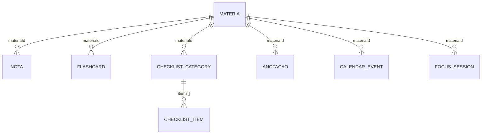

# 03 — "Banco de Dados" (Persistência)

O Estudix não tem um banco de dados relacional nem um servidor. O equivalente funcional a um banco de dados é um **único documento JSON** guardado no armazenamento local do dispositivo via `@react-native-async-storage/async-storage`.

- **Chave:** `@Estudix:state`
- **Formato:** JSON serializado do objeto de estado inteiro
- **Escrita:** com *debounce* de 1000ms (`saveStore` em `EstudixContext.js`) — evita gravar em disco a cada tecla digitada ou tick do cronômetro
- **Leitura:** uma vez, no `useEffect` de montagem do `EstudixProvider`

## Forma do documento (estado completo)

```jsonc
{
  "settings": {
    "userName": "Estudante",
    "focusMin": 25, "shortBreakMin": 5, "longBreakMin": 15,
    "onboarded": false,

    // Perfil Educacional (adicionado nesta funcionalidade)
    "educationLevel": null,     // um id de EDUCATION_LEVELS ou null
    "goal": null,                // um id de GOALS ou null
    "difficulties": [],          // array de ids de DIFFICULTIES
    "studyMethod": null,         // um id de STUDY_METHODS ou null
    "weeklyGoalMinutes": 300     // meta semanal em minutos
  },
  "materias": [ { "id": "mat-...", "name": "", "icon": "", "color": "" } ],
  "notas": [ { "id": 0, "materiaId": "mat-...", "label": "", "value": 0 } ],
  "flashcards": [ { "id": 0, "materiaId": "mat-...", "question": "", "answer": "",
                     "flipped": false, "easeFactor": 2.5, "interval": 0,
                     "repetitions": 0, "dueDate": "YYYY-MM-DD" } ],
  "checklistCategories": [ { "id": 0, "materiaId": "mat-...", "title": "",
                              "items": [ { "id": 0, "text": "", "done": false } ] } ],
  "anotacoes": [ { "id": 0, "title": "", "content": "", "materiaId": "mat-...",
                    "createdAt": 0, "updatedAt": 0 } ],
  "focusSessions": [ { "id": 0, "materiaId": "mat-...", "minutes": 0, "date": "YYYY-MM-DD" } ],
  "calendar": {
    "viewYear": 2026, "viewMonth": 0,
    "events": [ { "id": 0, "title": "", "description": "", "date": "YYYY-MM-DD",
                   "type": "evento", "materiaId": "mat-...", "notificationId": "",
                   "createdAt": 0, "updatedAt": 0 } ],
    "calSelectedDate": "YYYY-MM-DD"
  },
  "timer": {
    "sessionType": "focus", "remainingSeconds": 1500, "totalSeconds": 1500,
    "isRunning": false, "sessionCount": 0, "cyclePosition": 0, "materiaId": null,
    "lastStudyDate": "YYYY-MM-DD", "totalMinutesToday": 0, "totalMinutesWeek": 0,
    "completedSessions": 0, "longestSession": 0,
    "currentStreak": 0, "longestStreak": 0, "lastSessionDate": null
  },
  "selectedMateriaId": null,
  "notesFilter": "all"
}
```

## Relacionamentos (todos por convenção de campo, não por *foreign key* real)



Como não há um banco relacional, essas relações são resolvidas em tempo de execução com `.filter(x => x.materiaId === id)` dentro das telas — não há índice, apenas arrays lineares (aceitável no volume de dados atual: dezenas de matérias, centenas de registros).

## Exclusão em cascata

`deleteMateria(id)` em `EstudixContext.js` remove manualmente a matéria de **todas** as coleções relacionadas (notas, flashcards, checklists, anotações, eventos do calendário) — não existe `ON DELETE CASCADE` automático porque não existe banco relacional; é responsabilidade explícita da função.

## Compatibilidade retroativa (equivalente a "migrations")

Não existe um sistema formal de versionamento de esquema (`schemaVersion`). A compatibilidade é feita no `loadStore()` com checagens pontuais `=== undefined` que preenchem valores padrão quando um backup antigo é carregado. Exemplo real (parte do código atual):

```js
if (parsed.settings) {
  if (parsed.settings.educationLevel === undefined)    parsed.settings.educationLevel = null;
  if (parsed.settings.goal === undefined)              parsed.settings.goal = null;
  if (parsed.settings.difficulties === undefined)      parsed.settings.difficulties = [];
  if (parsed.settings.studyMethod === undefined)       parsed.settings.studyMethod = null;
  if (parsed.settings.weeklyGoalMinutes === undefined) parsed.settings.weeklyGoalMinutes = 300;
}
```

Esse padrão é reaproveitado a cada novo campo adicionado a `settings` — é simples e funciona bem na escala atual do app. Os relatórios de arquitetura anteriores recomendam formalizar isso com um campo `schemaVersion` quando o número de campos versionados crescer o suficiente para tornar os `if`s difíceis de acompanhar; isso ainda não aconteceu.

## Backup / Restauração

`exportData()` e `importData()` (em `EstudixContext.js`) serializam/desserializam um subconjunto do estado (tudo exceto `selectedMateriaId` e `notesFilter`, que são navegação efêmera) como arquivo `.json`, usando `expo-file-system` e `expo-sharing`/`expo-document-picker`. Isso é o único mecanismo de "exportar meu banco de dados" hoje disponível.

## Catálogo de disciplinas (não implementado)

Os relatórios de arquitetura anteriores definem que um futuro catálogo de disciplinas **não deve** entrar neste mesmo documento JSON — deve ser um asset estático do bundle do app (somente leitura, igual para todos os usuários). Ver `01_ARCHITECTURE.md` dos relatórios de análise para o racional completo. Nenhum código de catálogo existe ainda no projeto.
