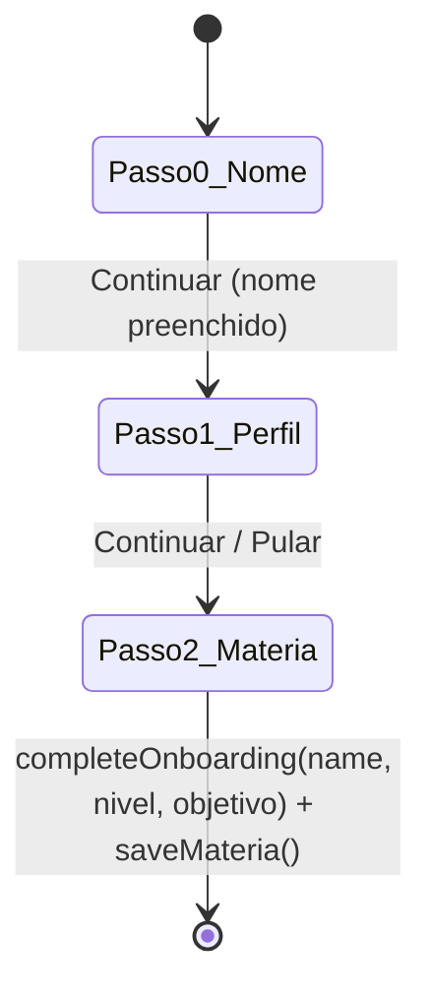

# 06 — Telas

Cada tela vive em `src/screens/`, consome `useEstudix()` diretamente (sem camada intermediária) e define seus próprios estilos locais via `StyleSheet.create`.

---

## OnboardingScreen *(alterado nesta funcionalidade)*

**Objetivo:** primeiro contato com o app — captura nome, Perfil Educacional básico e a primeira matéria. Só é exibida enquanto `state.settings.onboarded === false` (decisão tomada em `App.js`).

**Fluxo (3 passos, controlados por `step` local):**

- **Passo 0 — Nome:** `TextInput` local (`name`), sem gravar no contexto ainda.
- **Passo 1 — Perfil** *(novo)*: dois `ChipSelector` (nível de escolaridade, objetivo), também em estado local (`educationLevel`, `goal`) — nada é persistido até o passo final. Envolvido em `ScrollView` porque a lista de níveis (10 opções) pode não caber em telas pequenas.
- **Passo 2 — Matéria:** `TextInput` local (`materiaName`); ao confirmar, chama `saveMateria` e `completeOnboarding` em sequência.

**Componentes usados:** `ChipSelector` (novo), `Ionicons`, `TextInput`/`TouchableOpacity` nativos.
**Estados locais:** `step`, `name`, `educationLevel`, `goal`, `materiaName`.
**Chamadas ao contexto:** `completeOnboarding(name, educationLevel, goal)`, `saveMateria(name)`.
**Navegação:** nenhuma — a troca para o app principal acontece automaticamente em `App.js` quando `onboarded` vira `true`.
**Melhoria futura possível:** quando o catálogo de disciplinas existir, o Passo 2 pode sugerir matérias do nível escolhido no Passo 1, em vez de um campo de texto livre único (já mapeado nos relatórios de arquitetura anteriores).

---

## HomeScreen

**Objetivo:** dashboard principal — saudação, atalho para iniciar foco, métricas rápidas (anotações/matérias/minutos hoje), tira de calendário, estatísticas de foco, conquistas, médias por matéria.
**Componentes usados:** `AppHeader`, sub-componentes locais `MetricCard` e `SectionHeader` (definidos no próprio arquivo, não exportados — não reutilizados em nenhuma outra tela hoje).
**Estados locais:** `floatAnim` (animação decorativa), forçador de re-render em foco de tela (`useFocusEffect`).
**Dados do contexto usados:** `settings`, `anotacoes`, `materias`, `timer`, `calendar`; funções `calcularMedia`, `setSelectedMateria`, `getGreeting`, `formatDate`, `getUnlockedAchievements`.
**Navegação:** para `BottomTabs/Foco`, `BottomTabs/Anotacoes`, `BottomTabs/Materias`, `Calendario`, `MateriaInterna`.

---

## MateriasScreen

**Objetivo:** grade de matérias cadastradas; criação de nova matéria via modal.
**Componentes usados:** `AppHeader`, `FAB`.
**Estados locais:** `modalVisible`, `newMateriaName`.
**Chamadas ao contexto:** `saveMateria`, `setSelectedMateria`, `calcularMedia`.
**Navegação:** para `MateriaInterna` ao tocar num card.

---

## MateriaInternaScreen

**Objetivo:** detalhe de uma matéria — três abas (Checklist, Notas, Flashcards), cada uma com seu próprio modal de criação/edição.
**Componentes usados:** `FAB`, `GradeChart` (aba Notas).
**Estados locais:** `activeTab` + um conjunto de estados de modal por aba (nota, checklist, flashcard).
**Chamadas ao contexto:** `calcularMedia`, `saveNota`/`deleteNota`, `saveCategoryTitle`/`saveChecklistItem`/`toggleChecklistItem`/`deleteChecklistItem`, `saveFlashcard`/`toggleFlashcard`/`deleteFlashcard`/`reviewFlashcard`.
**Detalhe de negócio:** a revisão de flashcard (`reviewFlashcard`) implementa SM-2 simplificado — ver [07_CONTEXT.md](./07_CONTEXT.md).

---

## FocoScreen

**Objetivo:** cronômetro Pomodoro com anel de progresso animado (SVG), seleção da matéria sendo estudada e dos três modos de sessão (foco/pausa curta/pausa longa).
**Componentes usados:** `AppHeader`, `Svg`/`Circle` (react-native-svg).
**Estados locais:** `progressAnim` (Animated.Value do anel), `notificationIdRef`.
**Chamadas ao contexto:** `updateTimer`, `getSessionDuration`, `finishTimerSession`, `setFocusMateria`.
**Serviço externo:** `scheduleFocusEndNotification`/`cancelNotification` de `lib/notifications.js`.
**Detalhe de negócio:** o `useEffect` do timer decrementa `remainingSeconds` a cada segundo via `updateTimer` — que, por sua vez, decide no contexto se essa mudança é "volátil" (não grava em disco) ou não.

---

## AnotacoesScreen

**Objetivo:** anotações livres com filtro por matéria.
**Componentes usados:** `AppHeader`, `FAB`.
**Estados locais:** `modalVisible`, `editingId`, `title`, `content`, `materiaId`.
**Chamadas ao contexto:** `saveAnotacao`, `deleteAnotacao`, `setNotesFilter`.

---

## CalendarioScreen

**Objetivo:** calendário mensal com grade de dias, eventos do dia selecionado, seletor de data nativo (`@react-native-community/datetimepicker`).
**Componentes usados:** `AppHeader`, `FAB`, `DateTimePicker`.
**Estados locais:** grid do modal de evento (`eventTitle`, `eventDescription`, `eventDate`, `eventType`, `materiaId`, `showDatePicker`).
**Chamadas ao contexto:** `saveEvent`, `deleteEvent`, `prevMonth`, `nextMonth`, `setCalSelectedDate`.

---

## ConfiguracoesScreen *(alterado nesta funcionalidade)*

**Objetivo:** editar nome, Perfil de Estudo *(novo)*, durações do Pomodoro, exportar/importar backup, limpar dados.
**Componentes usados:** `AppHeader`, `ChipSelector` *(novo)*.
**Estados locais:** `modalVisible`/`tempName` (nome), `profileModalVisible` *(novo)* — controla o modal de Perfil de Estudo.
**Chamadas ao contexto:** `setUserName`, `changeSetting` (agora também aceita `'weekly'`), `clearAllData`, `exportData`, `importData`, `showConfirm`, e as novas `setEducationLevel`, `setGoal`, `setStudyMethod`, `toggleDifficulty`.
**Seção nova — "Perfil de Estudo":** item clicável dentro do card "PERFIL" que abre um modal com quatro `ChipSelector` (nível, objetivo, dificuldades — múltiplo, método) e um stepper de meta semanal reaproveitando exatamente o padrão visual já usado pelos steppers do Pomodoro.

---

## MenuScreen

**Objetivo:** menu lateral (drawer modal, animado com `Animated.spring`) com atalhos de navegação e saudação.
**Componentes usados:** nenhum de `src/components/` — é autocontido.
**Navegação:** para `BottomTabs` (Home/Matérias/Foco), `Calendario`, `Configuracoes`.
