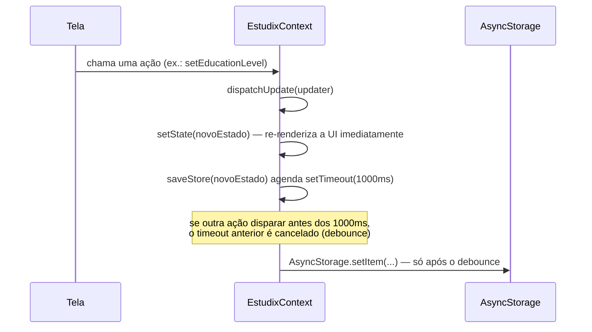

# 07 — Contexto (`EstudixContext`)

**Arquivo:** `src/context/EstudixContext.js`
É o único contexto React do app — estado global, todas as mutações, persistência, backup, notificações e feedback visual (Toast/ConfirmModal) vivem aqui. Consumido via o hook `useEstudix()`.

## Estado (`state`)

Ver a forma completa em [03_DATABASE.md](./03_DATABASE.md). Resumo dos slices:

| Slice | Conteúdo |
|---|---|
| `settings` | preferências do usuário + Perfil Educacional *(novo)* |
| `materias` | disciplinas cadastradas pelo usuário |
| `notas` | avaliações por matéria |
| `flashcards` | cartões de revisão espaçada (SM-2) |
| `checklistCategories` | categorias + itens de checklist por matéria |
| `anotacoes` | notas livres |
| `focusSessions` | histórico de sessões de foco concluídas |
| `calendar` | eventos, mês/ano em exibição, data selecionada |
| `timer` | estado do cronômetro Pomodoro em tempo real |
| `selectedMateriaId`, `notesFilter` | navegação/filtros efêmeros |

## Ações (mutations) — quem usa cada uma

| Grupo | Funções | Consumido por |
|---|---|---|
| Backup | `exportData`, `importData` | ConfiguracoesScreen |
| Settings | `setUserName`, `changeSetting` | ConfiguracoesScreen |
| Onboarding | `completeOnboarding` | OnboardingScreen |
| **Perfil Educacional** *(novo)* | `setEducationLevel`, `setGoal`, `setStudyMethod`, `toggleDifficulty` | ConfiguracoesScreen (edição contínua); `completeOnboarding` cobre nível/objetivo no fluxo inicial |
| Matérias | `saveMateria`, `deleteMateria` | MateriasScreen, MateriaInternaScreen, OnboardingScreen |
| Notas | `saveNota`, `deleteNota` | MateriaInternaScreen |
| Flashcards | `toggleFlashcard`, `saveFlashcard`, `deleteFlashcard`, `reviewFlashcard` | MateriaInternaScreen |
| Checklist | `saveCategoryTitle`, `deleteCategory`, `saveChecklistItem`, `toggleChecklistItem`, `deleteChecklistItem` | MateriaInternaScreen |
| Anotações | `saveAnotacao`, `deleteAnotacao`, `setNotesFilter` | AnotacoesScreen |
| Calendário | `saveEvent`, `deleteEvent`, `setCalendarView`, `setCalSelectedDate`, `prevMonth`, `nextMonth` | CalendarioScreen, HomeScreen |
| Timer | `updateTimer`, `finishTimerSession`, `setFocusMateria`, `getSessionDuration` | FocoScreen |
| Utilitário | `setSelectedMateria`, `clearAllData` | várias telas |
| Feedback | `showToast`, `showConfirm` | qualquer tela |

## `setEducationLevel` / `setGoal` / `setStudyMethod` / `toggleDifficulty` *(novo)*

```js
const setEducationLevel = (id) => {
  updateNested('settings', { educationLevel: id });
  Haptics.selectionAsync();
};
```

- **Objetivo:** editar um campo de seleção única do Perfil Educacional a qualquer momento (fora do onboarding).
- **Parâmetros:** `id` — string, um dos ids de `EDUCATION_LEVELS`/`GOALS`/`STUDY_METHODS`.
- **Retorno:** nenhum (efeito colateral: `dispatchUpdate` + persistência com debounce).
- **Quem chama:** `ConfiguracoesScreen` (via `ChipSelector.onToggle`).
- **Complexidade:** O(1).

`toggleDifficulty` é o único desses quatro que precisa de lógica de array (seleção múltipla):

```js
const toggleDifficulty = (id) => {
  dispatchUpdate(prev => {
    const current = prev.settings.difficulties || [];
    const difficulties = current.includes(id)
      ? current.filter(d => d !== id)
      : [...current, id];
    return { ...prev, settings: { ...prev.settings, difficulties } };
  });
  Haptics.selectionAsync();
};
```

- **Fluxo:** lê o array atual → adiciona ou remove o id → grava o array novo. Segue o mesmo padrão imutável usado em todo o resto do contexto (nunca muta o array anterior diretamente).
- **Complexidade:** O(n) no tamanho de `difficulties` (n ≤ 6 hoje — irrelevante na prática).

## `completeOnboarding` *(assinatura alterada)*

```js
const completeOnboarding = (name, educationLevel, goal) => { ... }
```

- **Antes:** recebia só `name`.
- **Agora:** recebe também `educationLevel` e `goal`, escritos em `settings` no mesmo `dispatchUpdate` que marca `onboarded: true` — uma única gravação atômica, em vez de várias chamadas separadas (`setEducationLevel` + `setGoal` + a gravação de nome), evitando debounces concorrentes durante a finalização do onboarding.
- **Compatibilidade:** os dois novos parâmetros usam `|| prev.settings.<campo>`, então chamar `completeOnboarding(name)` sem os dois últimos argumentos continua funcionando (não quebra nenhum outro código que porventura chamasse essa função só com o nome).

## `changeSetting` *(estendido)*

Ganhou o tipo `'weekly'` para a meta semanal (`weeklyGoalMinutes`), seguindo exatamente o padrão já existente para `'focus'`/`'short'`/`'long'`:

```js
if (type === 'weekly') s.weeklyGoalMinutes = Math.max(60, Math.min(1200, s.weeklyGoalMinutes + delta));
```

Nenhuma função nova foi criada para isso — reaproveitou-se a função genérica existente, que já era parametrizada por `type`.

## Persistência — fluxo completo



## Quem usa cada slice de estado (visão inversa)

| Slice | Telas que leem | Telas que escrevem |
|---|---|---|
| `settings` (Perfil Educacional) | ConfiguracoesScreen | OnboardingScreen (nível/objetivo), ConfiguracoesScreen (todos os campos) |
| `materias` | Home, Matérias, MatériaInterna, Foco, Anotações, Calendário | Matérias, MatériaInterna, Onboarding |
| `timer` | Home, Foco | Foco |
| `calendar` | Home, Calendário | Calendário |
