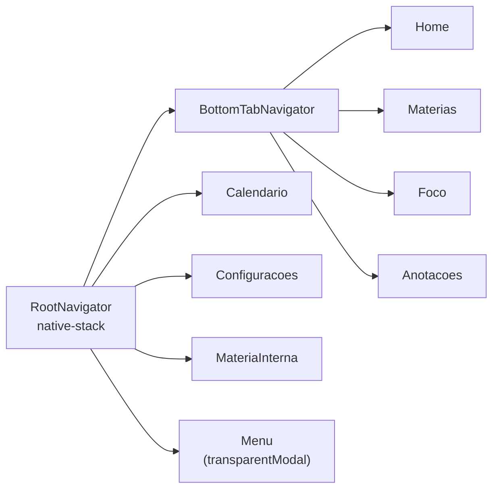
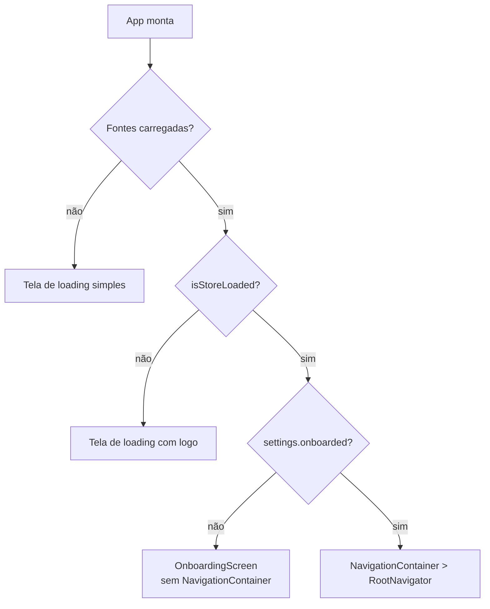

# 08 — Navegação

Biblioteca: `@react-navigation/native` + `native-stack` (raiz) + `bottom-tabs` (tabs internas).



## RootNavigator (`src/navigation/RootNavigator.js`)

Stack sem cabeçalho nativo (`headerShown: false` — cada tela desenha seu próprio `AppHeader`).

| Rota | Componente | Observação |
|---|---|---|
| `BottomTabs` | `BottomTabNavigator` | tela inicial da stack |
| `Calendario` | `CalendarioScreen` | |
| `Configuracoes` | `ConfiguracoesScreen` | |
| `MateriaInterna` | `MateriaInternaScreen` | lê `state.selectedMateriaId`, não recebe params de rota |
| `Menu` | `MenuScreen` | `presentation: 'transparentModal'`, `animation: 'fade'` — abre por cima da tela atual |

## BottomTabNavigator (`src/navigation/BottomTabNavigator.js`)

| Rota | Componente | Ícone (inativo → ativo) |
|---|---|---|
| `Home` | `HomeScreen` | `home-outline` → `home` |
| `Materias` | `MateriasScreen` | `book-outline` → `book` |
| `Foco` | `FocoScreen` | `time-outline` → `time` |
| `Anotacoes` | `AnotacoesScreen` | `document-text-outline` → `document-text` |

Labels de texto ficam ocultos (`tabBarShowLabel: false`) — só o ícone muda de outline para preenchido.

## Decisão de qual navegador é montado

`App.js` decide, **fora** do React Navigation, entre três telas raiz:



Isso significa que **o Onboarding não faz parte da árvore de navegação** — não há como "voltar" para ele depois de completado, e ele não aparece no histórico de navegação. Essa é uma escolha existente, não alterada por esta funcionalidade (o novo passo de Perfil Educacional é só mais um `step` dentro do mesmo componente).

## Navegação com parâmetros de tab

Alguns pontos do app navegam direto para uma tab específica dentro do `BottomTabs`, ex.:

```js
navigation.navigate('BottomTabs', { screen: 'Foco' })
```

Usado em `HomeScreen` (métricas, botão de foco) e `MenuScreen`.
