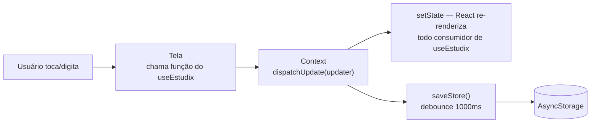
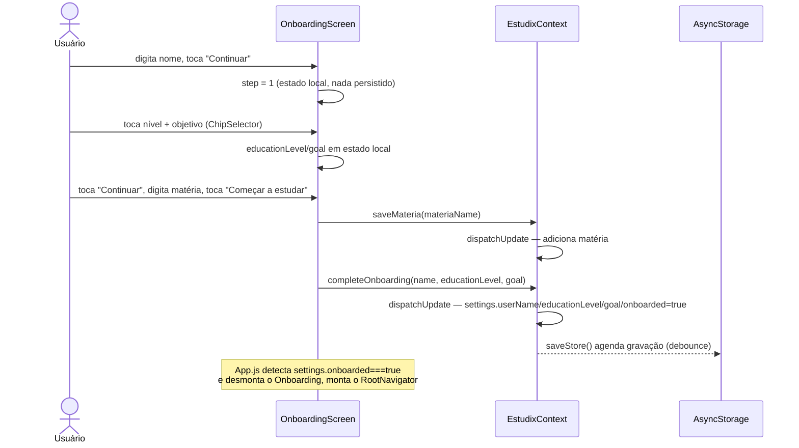
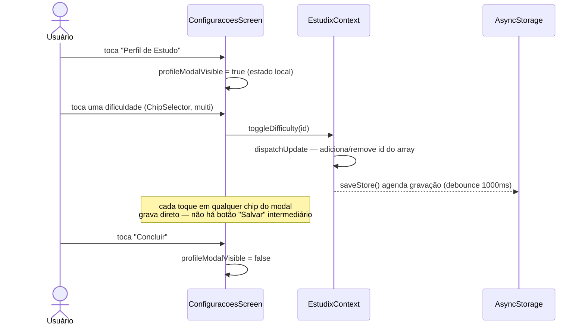
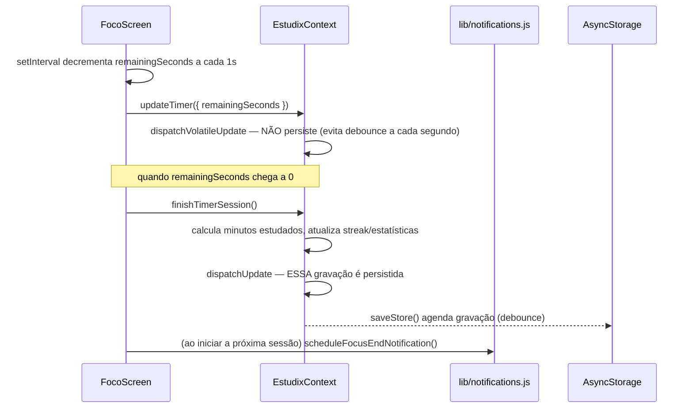
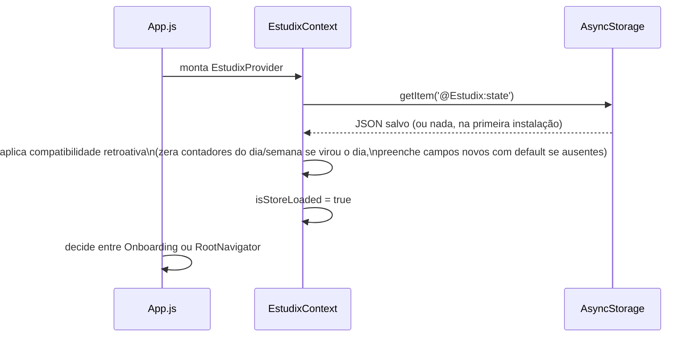

# 13 — Fluxo de Dados

Padrão geral, presente em toda ação do app:

```
Usuário → Tela → Context (ação) → [Serviço externo opcional] → Persistência (debounce) → Re-render
```

## Fluxo genérico



## Fluxo 1 — Completar o Onboarding *(inclui o Perfil Educacional novo)*



## Fluxo 2 — Editar Perfil de Estudo em Configurações



## Fluxo 3 — Sessão de Foco (Pomodoro) concluída



## Carregamento inicial do app


